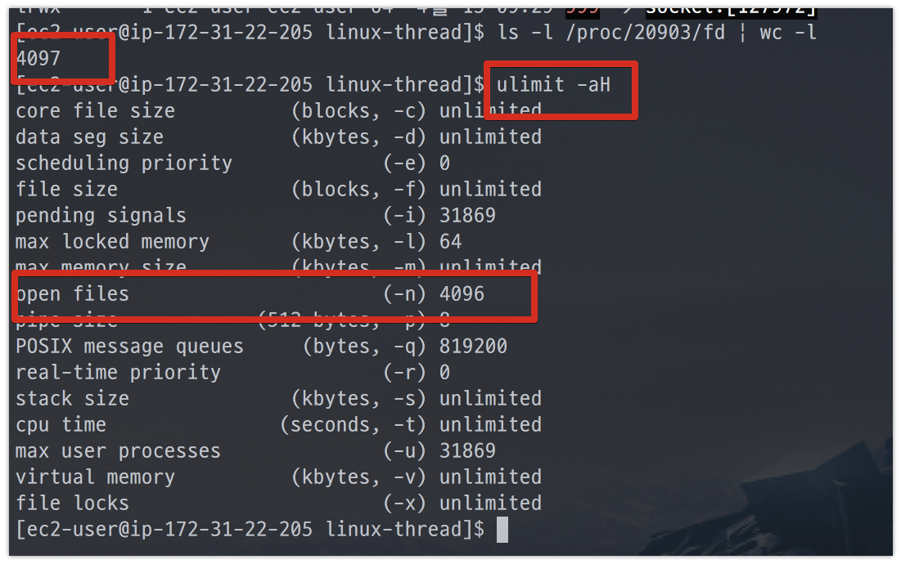
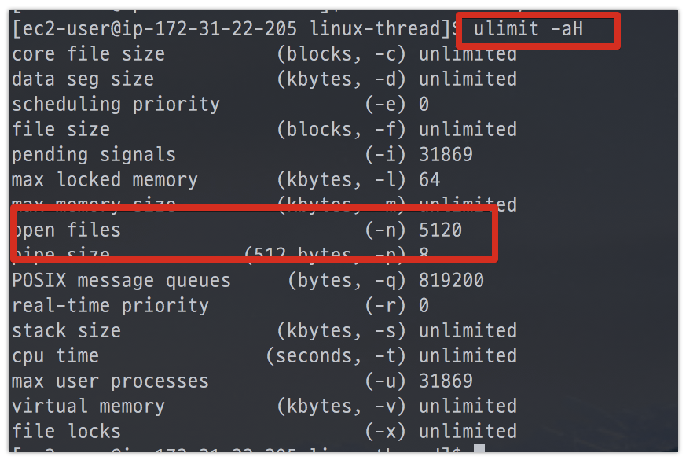
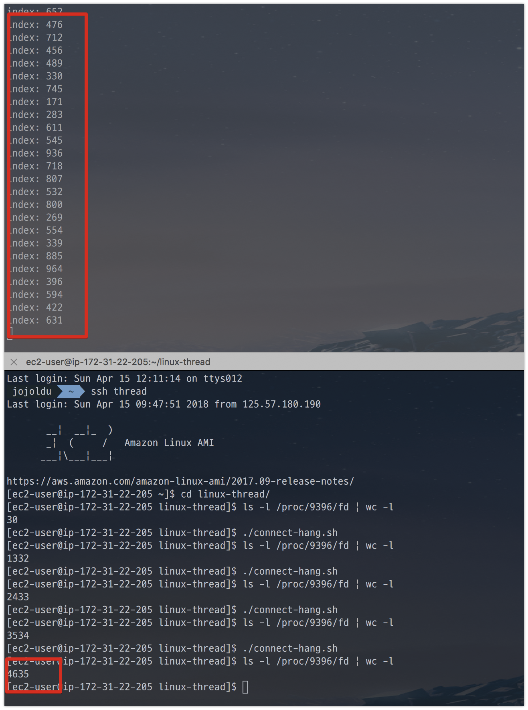
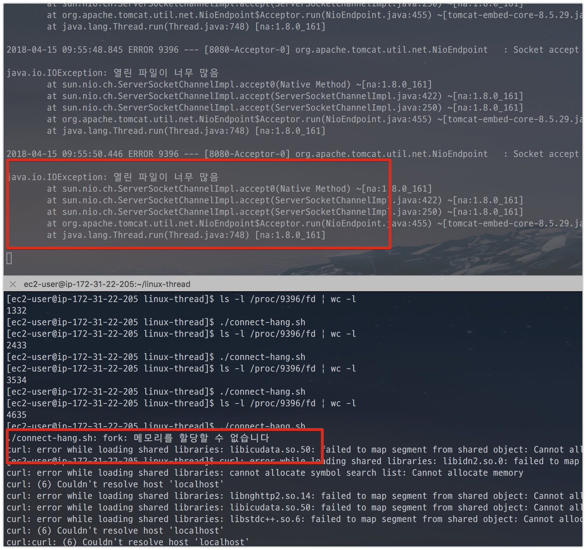

# Linux에서 Thread 설정

Linux에서 open files, max user processes 설정에 대해 아는게 없어 정리하게 되었습니다!  
팀에서 작업하던 중, 쓰레드와 관련해서 문제가 발생했습니다.  
제가 진행하던 일이 아니라서 옆에서 해결하는 과정을 지켜봤었는데요.  
부끄럽게도 **전혀 모르는 내용이 오고가서 복기 차원에서 공부하고 기록**합니다.  
  
본문의 모든 내용은 테스트를 위해 임의로 생성한 코드들입니다.  
모든 코드는 [Github](https://github.com/jojoldu/linux-thread)에 있으니 필요하시면 언제든지 사용하셔도 됩니다.  


## 1. Max user processes

Linux에는 OS 레벨에서의 제한 설정이 있습니다.  
보통 이를 ```ulimit``` (user limit) 이란 명령어로 확인하는데요.  
2가지 옵션으로 대부분 확인합니다.  

* ```ulimit -a```
  * soft ulimit
* ```ulimit -aH```
  * hard ulimit

톰캣을 이용해서 서버 운영 도중, 다음과 같이 ```OutOfMemoryError```가 발생했다고 가정하겠습니다.


더이상 쓰레드를 생성할 수 없다는 에러인데요.  
뭐가 문제였는지 하나씩 확인해보겠습니다.  
맨 처음 서버를 할당 받은 초기 상태 그대로라 ```ulimit -a```는 아래와 같습니다.


화면을 보시면 ```open files``` 와 ```max user processes```의 값이 **1024로 동일하게** 잡혀있습니다.  
쓰레드 생성에 문제가 발생한거라 ```max user processes```가 문제인것 같지만, 확신할 수 없으니 테스트 환경을 구축해서 실험해보겠습니다.  


테스트용 서버는 AWS EC2의 **t2.micro**입니다.  
t2.micro로 생성후 ```ulimit -a```로 확인해보겠습니다.


t2.micro는 기본 설정이 ```open files```가 1024, ```max user processes```가 3902로 잡혀있다는 것을 알 수 있습니다.  
  
자 그럼 간단하게 추측할 수 있는 것이, 현재 설정에서 ```1024 <= 동시에 생성가능한 쓰레드수 <= 3902```라면 ```max user processes```가 부족해서 발생한 문제임을 알 수 있겠죠?  
이를 확인하기 위해 간단한 스프링부트 프로젝트를 생성하겠습니다.  
  
코드는 간단합니다. ```/4000```으로 HTTP 요청이 오면 **비동기로 4천개의 쓰레드를 동시에 생성**하고, 20분간 유지합니다.


프로젝트를 테스트용 EC2에 배포하고 ```curl```과  ```tail -f nohup```으로 확인해보겠습니다.  


## 2. Open files

자 그럼, 위에 있던 open files 값은 어떤 값을 가리키는지 알아보겠습니다.  


단순 쓰레드 생성과 달리, **EC2의 서버 메모리가 먼저 부족**해져서 EC2 사양을 높여서 다시 실험해보겠습니다.  


(t2.micro는 메모리가 1GB인지라, t2.large (8GB) 로 변경합니다.)  
  
업데이트된 EC2의 ```ulimit```은 아래와 같습니다.


> AWS EC2의 사양을 올릴수록 ```max user processes```가 적절한 값으로 증가하는 것을 확인할 수 있습니다.  
AWS EC2를 사용하실 경우 ```max user processes```에 대해서 전혀 수정할 필요가 없겠습니다.

전체 오픈 파일 개수

```bash
echo "OS Total Open File & Socket Count - `lsof | wc -l `"
```

root 사용자 제외한 오픈 파일 개수

```bash
lsof | awk '$3 !~ /root/ {print $0}' | wc -l
```












```bash
ls -l /proc/$PID/fd | wc -l
```

> 참고로 Tomcat은 8 버전부터 기본 Connector 방식을 NIO로 사용합니다.  
(7 버전까지는 BIO)  
그러다보니 maxConnections은 10,000, maxThreads는 200이 기본값입니다.  
(BIO에서는 둘의 값이 동일해야 합니다)

## 설정법

리눅스 서버에서 ```/etc/security/limits.conf``` 파일을 열어 수정합니다.


## 참고

* [호스트웨이 ulimit 설정관련](http://faq.hostway.co.kr/Linux_ETC/7179)
* [리눅스 서버의 TCP 네트워크 성능을 결정짓는 커널 파라미터 이야기](http://meetup.toast.com/posts/53)