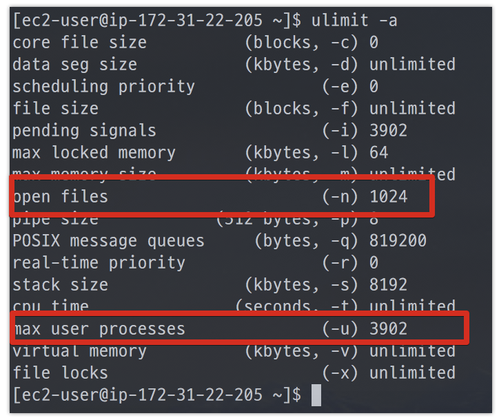
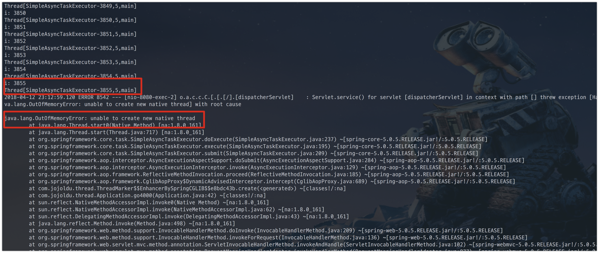
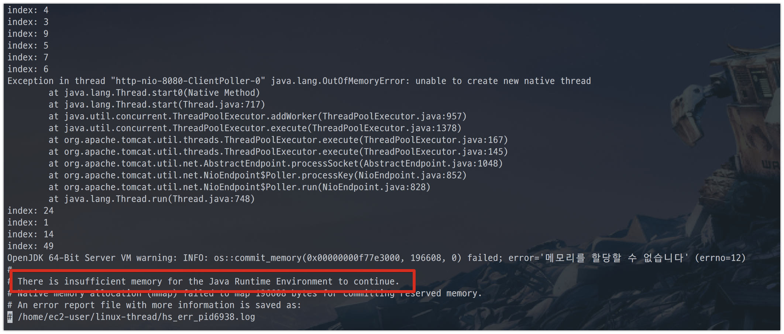
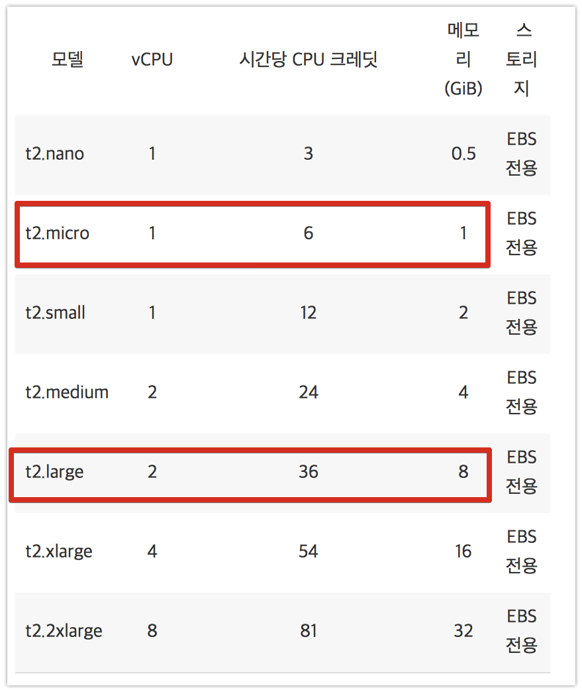
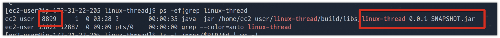
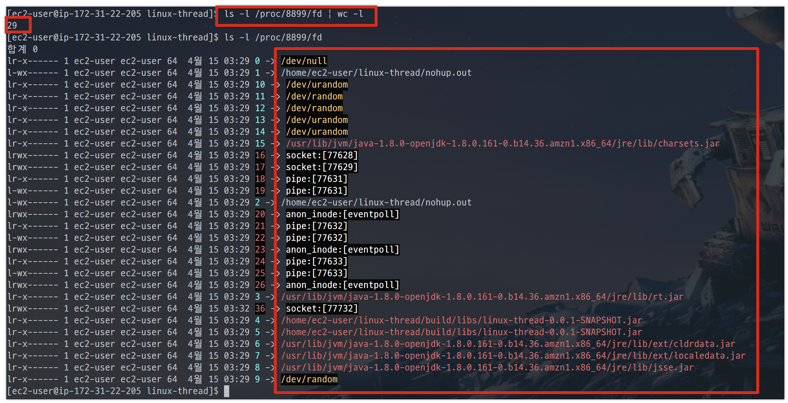

# Linux에서 Thread 설정

Linux에서 Open File Descriptors, Max User Processes, Thread의 차이에 대한 실험  
  
팀에서 배포하던 중, 쓰레드와 관련해서 문제가 발생했습니다.  
제가 진행하던 일이 아니라서 옆에서 해결하는 과정을 지켜봤었는데요.  
부끄럽게도 전혀 모르는 내용이 오고가서 복기 차원에서 공부하고 기록합니다.





## 1. Thread




## 2. Socket

자 그럼, 위에 있던 open files 값은 어떤 값을 가리키는지 알아보겠습니다.  

### Tomcat 설정

> Tomcat은 다음 두 가지 모드로 작동 할 수 있습니다.  
BIO (연결 당 하나의 스레드) 또는 NIO (스레드보다 더 많은 연결).  
Tomcat7은 기본적으로 BIO(Blocking IO)이지만, "모든면에서 NIO (NonBlocking IO)가 더 뛰어나므로 Bio를 사용하지 마십시오"라고 생각됩니다.  
만약 BIO를 사용한다면, 2개 설정은 동일해야합니다.  
NIO를 사용한다면 실제로 "maxConnections = 1000"과 "maxThreads = 10"이 합리적 일 수 있습니다.  
기본값은 maxConnections = 10,000 및 maxThreads = 200입니다.  
NIO를 사용하면 각 스레드는 원하는 수만큼의 연결을 처리 할 수 있습니다.  
앞뒤로 전환하면서 연결을 유지하므로 HTTPS의 경우 특히 많은 시간이 소요되는 일반적인 핸드 셰이 킹을 수행 할 필요가 없으며 HTTP의 경우에도 문제가 발생합니다.  
"keepAlive"매개 변수를 조정하여 연결을 오래 유지하면 모든 작업의 속도가 빨라집니다.




단순 쓰레드 생성과 달리, **EC2의 서버 메모리가 먼저 부족**해져서 EC2 사양을 높여서 다시 실험해보겠습니다.  



(t2.micro는 메모리가 1GB인지라, t2.large (8GB) 로 변경합니다.)  
  

전체 오픈 파일 개수

```bash
echo "OS Total Open File & Socket Count - `lsof | wc -l `"
```

root 사용자 제외한 오픈 파일 개수

```bash
lsof | awk '$3 !~ /root/ {print $0}' | wc -l
```

open file은 해당 서버의 전체 오픈 파일 개수가 아닐 수 있겠는데?  






## 설정법

리눅스 서버에서 ```/etc/security/limits.conf``` 파일을 열어 수정합니다.


## 참고

* [호스트웨이 ulimit 설정관련](http://faq.hostway.co.kr/Linux_ETC/7179)