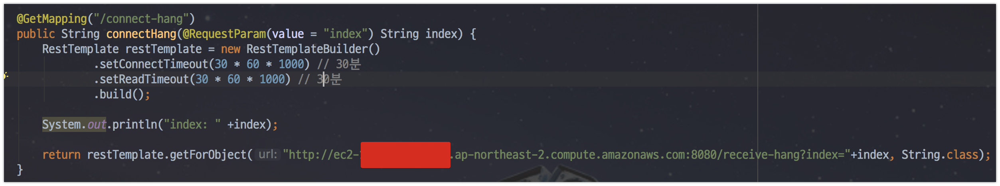

# open files, max user processes

Linux에서 open files, max user processes 설정에 대해 아는게 없어 정리하게 되었습니다!  
팀에서 작업하던 중, 쓰레드와 관련해서 문제가 발생했습니다.  
제가 진행하던 일이 아니라서 옆에서 해결하는 과정을 지켜봤었는데요.  
부끄럽게도 **전혀 모르는 내용이 오고가서 복기 차원에서 공부하고 기록**합니다.  
  
본문의 모든 내용은 테스트를 위해 임의로 생성한 코드들입니다.  
모든 코드는 [Github](https://github.com/jojoldu/linux-thread)에 있으니 필요하시면 언제든지 사용하셔도 됩니다.  


## 1. Max user processes

Linux에는 OS 레벨에서의 제한 설정이 있습니다.  
보통 이를 ```ulimit``` (user limit) 이란 명령어로 확인하는데요.  
2가지 옵션으로 대부분 확인합니다.  

* ```ulimit -a```
  * soft ulimit
* ```ulimit -aH```
  * hard ulimit

톰캣을 이용해서 서버 운영 도중, 다음과 같이 ```OutOfMemoryError```가 발생했다고 가정하겠습니다.


더이상 쓰레드를 생성할 수 없다는 에러인데요.  
뭐가 문제였는지 하나씩 확인해보겠습니다.  
맨 처음 서버를 할당 받은 초기 상태 그대로라 ```ulimit -a```는 아래와 같습니다.


화면을 보시면 ```open files``` 와 ```max user processes```의 값이 **1024로 동일하게** 잡혀있습니다.  
쓰레드 생성에 문제가 발생한거라 ```max user processes```가 문제인것 같지만, 확신할 수 없으니 테스트 환경을 구축해서 실험해보겠습니다.  


테스트용 서버는 AWS EC2의 **t2.micro**입니다.  
t2.micro로 생성후 ```ulimit -a```로 확인해보겠습니다.


t2.micro는 기본 설정이 ```open files```가 1024, ```max user processes```가 3902로 잡혀있다는 것을 알 수 있습니다.  
  
자 그럼 간단하게 추측할 수 있는 것이, 현재 설정에서 ```1024 <= 동시에 생성가능한 쓰레드수 <= 3902```라면 ```max user processes```가 부족해서 발생한 문제임을 알 수 있겠죠?  
이를 확인하기 위해 간단한 스프링부트 프로젝트를 생성하겠습니다.  
  
코드는 간단합니다. ```/4000```으로 HTTP 요청이 오면 **비동기로 4천개의 쓰레드를 동시에 생성**하고, 20분간 유지합니다.


프로젝트를 테스트용 EC2에 배포하고 ```curl```과  ```tail -f nohup```으로 확인해보겠습니다.  


사진속을 보시면 3855개에서 ```unable to create new native thread``` 에러 메세지가 발생했습니다.  
톰캣에서 **쓰레드 생성시 open file 개수(1024개)을 초과해서 생성**된 것입니다.  
[Linux에서 쓰레드는 본질적으로 Linux의 공유 주소 공간을 가진 프로세스라는 답변](https://stackoverflow.com/a/344292)대로 **max user processes만큼만 쓰레드가 생성**된것을 확인할 수 있습니다.

## 2. Open files

두번째로 위에 있던 open files 값은 어떤 값을 가리키는지 알아보겠습니다.  
[open files에 관해 검색](http://meetup.toast.com/posts/54)을 해보면 이 값이 **프로세스가 가질 수 있는 소켓 포함 파일 개수**를 나타낸다는 것을 알 수 있습니다.  
  
자 그럼 **소켓을 open files 값 보다 많이 만들면** 어떻게 되는지 테스트 해보겠습니다.  
테스트 방법은 간단합니다.  

* RestTemplate로 다른 서버로 API요청 (소켓 생성)을 보내고, 해당 서버에서는 20분간 응답을 대기 시킵니다.  
* 위 요청을 동시에 1100개를 보냅니다.
* open files의 제한이 1024개이기 때문에 1100개가 발송되기전에 open files 관련된 에러가 발생하면 실험 성공!

API 요청을 받아, 20분간 대기시켜줄 서버로 ec2를 한대 더 생성합니다.  
  
테스트에 사용한 코드는 다음과 같습니다.  
  
**요청을 보낼 메소드**



**요청을 받을 메소드**


자 그리고 **동시에 1100개의 요청**을 보낼수 있도록 간단한 비동기 요청 스크립트를 만듭니다.


(실제 운영환경에선 [Ngrinder](http://naver.github.io/ngrinder/)등을 통해서 하겠지만, 여기선 간단한 테스트이니 스크립트로 대체합니다.)  
  
준비가 다 되었으니 한번 테스트를 진행해보겠습니다!  

.....

테스트를 진행하자마자 바로 에러가 발생했습니다.  
로그를 확인해보니


단순 쓰레드 생성과 달리, **EC2의 서버 메모리가 먼저 부족**해져서 EC2 사양을 높여서 다시 실험하겠습니다.  


(t2.micro는 메모리가 1GB인지라, t2.large (8GB) 로 변경합니다.)  
  
업데이트된 EC2의 ```ulimit```은 아래와 같습니다.


> AWS EC2의 사양을 올릴수록 ```max user processes```가 적절한 값으로 증가하는 것을 확인할 수 있습니다.  
이를 통해 알 수 있는 것은, AWS EC2를 사용하실 경우 ```max user processes``` AWS 내부에서 인스턴스 사양에 맞게 적절한 값을 세팅해주니, 굳이 저희가 손댈필요는 없다는 것입니다.

자 그럼 다시 한번 테스트를 해보겠습니다.  
테스트용 서버에 프로젝트를 배포하고, 해당 프로젝트가 생성한 open file count를 아래 명령어로 확인합니다.

```bash
ls -l /proc/$PID/fd | wc -l
```


PID를 찾고,  


생성된 open file 리스트를 확인할 수 있습니다.  
준비가 다 되었으니, 1100개 요청을 보내는 스크립트를 실행해봅니다!


엇?  
결과가 뭔가 이상합니다.  
분명 ```open files```의 값은 1024개로 되어있는데 1330개가 열려있다고 나오다니요.  
  
이상하다는 생각에 스크립트를 몇번 더 실행합니다.  
(한번 실행때마다 1100개의 요청이 간다고 생각하시면 됩니다.)  
  


2번을 추가로 더 실행해서 **3300개의 요청이 갔음에도 에러없이 처리**되고 있습니다.  
언제 터지는지 확인하기 위해 추가로 더 요청해봅니다 (총 4400개가 갑니다.)  


드디어 Open File 에러가 발생했습니다!  
보시면 4097개까지만 열린채로 에러가 발생한 것을 알 수 있는데요.  
**이전 요청이 3532개를 생성했으니 추가로 1100개를 요청하면 4600개 이상이 생성되어야**하는데 왜 4097개까지만 생성된 것인지 궁금합니다.  
  
혹시나 하는 마음에 ```ulimit -aH```로 soft가 아닌, hard옵션을 확인해봅니다.
  


오?  
마침 딱 4096개 입니다!  
프로세스별 open file은 **soft 값이 아닌 hard 값까지 생성**가능한게 아닐까? 라는 추측이 됩니다.  
검증하기 위해 hard의 open files를 **5120**개로 증가시킵니다.  
(soft 옵션은 그대로 1024개 입니다.)  


자 그리고 다시 요청을 진행해보겠습니다.  
이번에 4096개가 넘는 요청이 가능해진다면 soft가 아닌, hard 값까지 생성 가능하다는걸 알수있겠죠?  


예상대로 4000개가 넘는 API 요청 (4635)이 가능해졌습니다!

실제로 ```ulimit -a```로 확인할 수 있는 soft 값으로 소켓 생성이 제한되지는 않는다는 것을 알 수 있습니다.  
결국 **소켓 생성 제한은 hard 옵션에 따라간다** 라는 이야기가 됩니다. 

....

### 추가


> 여기서 3개를 빼야하는 이유는 stdin, stdout, stderr의 표준 입/출력이 포함됐기 때문입니다.


JVM 로그를 확인해보니!


이렇게 ```setlimit```으로 limit 제한을 올리는 로그가 찍혀있습니다!


[오라클 Java 옵션](http://www.oracle.com/technetwork/articles/java/vmoptions-jsp-140102.html)

[Linux Code](https://github.com/dmlloyd/openjdk/blob/c3f27ada97987466e9c6e33e02e676bd69b78664/src/hotspot/os/linux/os_linux.cpp#L4998)

> 참고로 Tomcat은 8 버전부터 기본 Connector 방식을 NIO로 사용합니다.  
(7 버전까지는 BIO)  
그러다보니 maxConnections은 10,000, maxThreads는 200이 기본값입니다.  
(BIO에서는 둘의 값이 동일해야 합니다)  
이번 테스트에서 사용되는 connection 수가 1만을 넘지 않기 때문에 기본옵션으로 진행했습니다.


## 설정법

서버의 open files, max user processes등 옵션을 permanent (영구) 적용하기 위해선 ```/etc/security/limits.conf``` 을 수정하면 됩니다.


맨 앞의 ```*```가 있는 자리는 사용자 계정을 나타냅니다.  
ec2-user로 지정하시면 ec2-user 계정에서만 옵션이 적용되는데요.  
이미지처럼 ```*```로 지정하시면 **모든 사용자 계정**에 옵션이 적용됩니다.  
  
이렇게 적용후, 다시 접속해서 확인해보시면!


옵션이 잘 적용되어있음을 확인할 수 있습니다.

## 참고

* [호스트웨이 ulimit 설정관련](http://faq.hostway.co.kr/Linux_ETC/7179)
* [리눅스 서버의 TCP 네트워크 성능을 결정짓는 커널 파라미터 이야기](http://meetup.toast.com/posts/53)